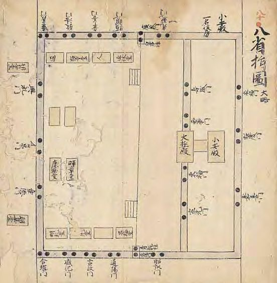

# 1　<ruby>拾芥抄<rp>(</rp><rt>しゅうがいしょう</rt><rp>)</rp></ruby>

<small>（重要文化財）</small>

　S○○○六-一。一巻。縦三〇・六㎝、全長八○○・六㎝。

　拾芥抄は、社会の諸事象、諸事物や文化を網羅した百科事典のような書で、三巻九九部からなる。部は、歳時、音楽、百官、<ruby>
年中行事<rp>(</rp><rt>ねんじゅうぎょうじ</rt><rp>)</rp>
</ruby>、宮城、本朝国郡、諸社、諸寺、飲食など多様で、公家・官人やその子弟の一般教養を記す。現代においては、平安・鎌倉時代の制度、社会や文化を知るための書でもある。鎌倉後期・南北朝期の公卿で故実に通じていた洞院公賢(一二九|~|三六〇)の撰述と伝えられる。史料編纂所本は、諸本中最古の一四世紀頃書写の残欠本で、諸本とは異なる内容も伝える。平安時代の様子を伝える平安宮の八省指図と宮城指図などを収める。掲載した図は、大極殿と朝堂からなる八省院(朝堂院)。北が右に描かれている。平安時代には、八省院は朝廷の特別な儀式の場となり日常の政務には用いられなかった。史料編纂所本の影印本には古典保存会複製書(一九三七)がある。活字本には、新訂増補故実叢書本がある。

 

**1 拾芥抄** <small>（重要文化財）</small>