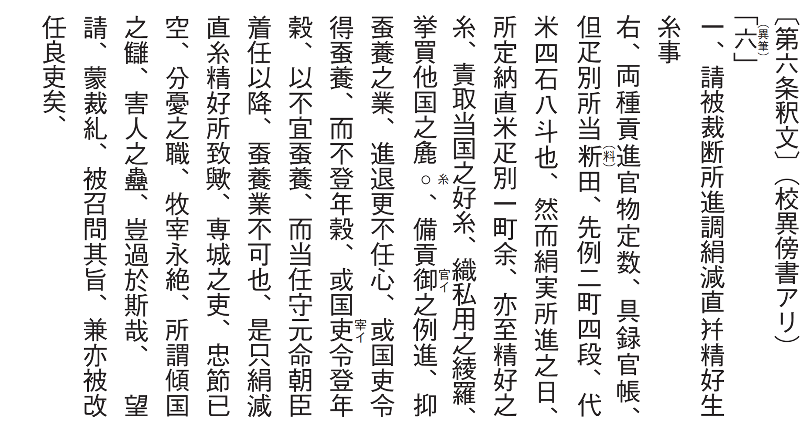

# 2　<ruby>尾張<rp>(</rp><rt>おわり</rt><rp>)</rp></ruby>の<ruby>国<rp>(</rp><rt>くに</rt><rp>)</rp></ruby><ruby>郡<rp>(</rp><rt>ぐん</rt><rp>)</rp></ruby><ruby>司百<rp>(</rp><rt>じひゃく</rt><rp>)</rp></ruby><ruby>姓<rp>(</rp><rt>せい</rt><rp>)</rp></ruby><ruby>等<rp>(</rp><rt>とう</rt><rp>)</rp></ruby><ruby>解<rp>(</rp><rt>げ</rt><rp>)</rp></ruby>

<a href="../pdf/002.pdf" target="_blank">PDF</a>

Ｓ○○七一‐五○。一巻。縦二九・二cm、全長一一三五・○cm。

<ruby>永<rp>(</rp><rt>えい</rt><rp>)</rp></ruby><ruby>延<rp>(</rp><rt>えん</rt><rp>)</rp></ruby>二（九八八）年、尾張国の郡司・百姓らが国守藤原<ruby>元命<rp>(</rp><rt>もとなが</rt><rp>)</rp></ruby>の非法を朝廷に訴え解任を要求するために作成した文書。尾張国郡司百姓等<ruby>解<rp>(</rp><rt>げ</rt><rp>)</rp></ruby><ruby>文<rp>(</rp><rt>ぶみ</rt><rp>)</rp></ruby>ともいう。一○世紀には、<ruby>受領<rp>(</rp><rt>ずりょう</rt><rp>)</rp></ruby>と呼ばれる国司の最上席者（通常は<ruby>守<rp>(</rp><rt>かみ</rt><rp>)</rp></ruby>）が国務全般を委ねられ、<ruby>郎等<rp>(</rp><rt>ろうどう</rt><rp>)</rp></ruby>を引き連れて<ruby>下<rp>(</rp><rt>げ</rt><rp>)</rp></ruby><ruby>向<rp>(</rp><rt>こう</rt><rp>)</rp></ruby>し、百姓へ過重な負担を課すなどして利益を得た。尾張国の郡司や百姓は、<ruby>出<rp>(</rp><rt>すい</rt><rp>)</rp></ruby><ruby>挙<rp>(</rp><rt>こ</rt><rp>)</rp></ruby>や<ruby>調庸<rp>(</rp><rt>ちょうよう</rt><rp>)</rp></ruby>の収取などをはじめとして三一か条の非法を訴えた。史料編纂所本は、一四世紀初に書写された古写本で、江戸時代末期には東大寺に伝来していた。一条から五条の途中までを欠き、また末尾の二紙は<ruby>応長<rp>(</rp><rt>おうちょう</rt><rp>)</rp></ruby>元（一三一一）年の補写。古写本には、他に早稲田大学本などがある。掲載した第六条は、元命が、絹の賦課基準を田二町四段あたり一<ruby>疋<rp>(</rp><rt>ひき</rt><rp>)</rp></ruby>から、田一町余あたり一疋に増やしたことを訴える（絹の納入にあたっての換算価格が二分の一以下に切り下げられたことを示す）。〔参考〕『新修稲沢市史』資料編三（一九八○）。阿部猛『尾張国解文の研究』（大原新生社、一九七一）。

<figure>
    
</figure>

 

<figure>
    
</figure>