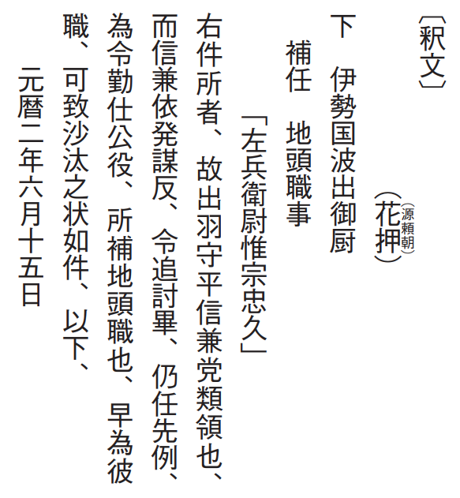
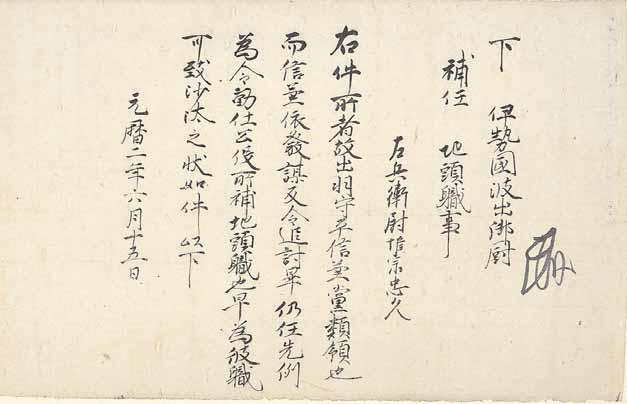

# 3　<ruby>源頼朝<rt>みなもとのよりとも</rt></ruby><ruby>袖<rt>そで</rt></ruby><ruby>判下文<rt>はんくだしぶみ</rt></ruby>（<ruby>島<rt>しま</rt></ruby><ruby>津<rt>づ</rt></ruby><ruby>家<rt>け</rt></ruby><ruby>文<rt>もん</rt></ruby><ruby>書<rt>じょ</rt></ruby>、<ruby>歴代<rt>れきだい</rt></ruby><ruby>亀<rt>き</rt></ruby><ruby>鑑<rt>かん</rt></ruby>）（国宝）

Ｓ島津家文書‐一‐一。一通。縦三〇・九cm、横四八・二cm。

『歴代亀鑑』二帖は島津家文書を代表する<ruby>手鑑<rt>てかがみ</rt></ruby>（書跡・経典・文書などを貼り込んだもの）。源頼朝・<ruby>後<rt>ご</rt></ruby><ruby>醍<rt>だい</rt></ruby><ruby>醐<rt>ご</rt></ruby>天皇・<ruby>足利<rt>あしかが</rt></ruby><ruby>尊氏<rt>たかうじ</rt></ruby>の文書など一○七通を収める。一七世紀後半以降に仕立てられたと考えられる。『大日本古文書』島津家文書之一に収める。<ruby>元暦<rt>げんりゃく</rt></ruby>二（一一八五）年六月十五日源頼朝袖判下文は、<ruby>寿永<rt>じゅえい</rt></ruby>三（一一八四、元暦元）年に頼朝に与えられた、平氏から没収した数百か所の所領を御家人に与えるにあたり、<ruby>伊<rt>い</rt></ruby><ruby>勢<rt>せ</rt></ruby>の<ruby>国<rt>くに</rt></ruby><ruby>波出<rt>はぜ</rt></ruby>の<ruby>御厨<rt>みくりや</rt></ruby>の<ruby>地<rt>じ</rt></ruby><ruby>頭職<rt>とうしき</rt></ruby>に<ruby>惟宗忠久<rt>これむねのただひさ</rt></ruby>を<ruby>補<rt>ぶ</rt></ruby><ruby>任<rt>にん</rt></ruby>したもの。忠久は島津氏の初代。島津家文書のなかで最も古い文書。まず地頭職を与えられる者の一行を抜いた本文が書かれ、ついで頼朝により忠久に給付することが決定され「<ruby>左兵<rt>さひょう</rt></ruby><ruby>衛尉<rt>えのじょう</rt></ruby>惟宗忠久」が書き込まれ、最後に文書の袖（右端）に頼朝が<ruby>花<rt>か</rt></ruby><ruby>押<rt>おう</rt></ruby>（判）を加えたと考えられる。〔参考〕『大日本古文書』島津家文書之一、一号。

〔釈文〕 
（花押（源頼朝））  下  伊勢国波出御厨  補任  地頭職事 「左兵衛尉惟宗忠久」 右件所者、故出羽守平信兼党類領也、而信兼依発謀反、令追討畢、仍任先例、為令勤仕公役、所補地頭職也、早為彼職、可致沙汰之状如件、以下、 元暦二年六月十五日

 

**3　源頼朝袖判下文（島津家文書、歴代亀鑑）（国宝）**