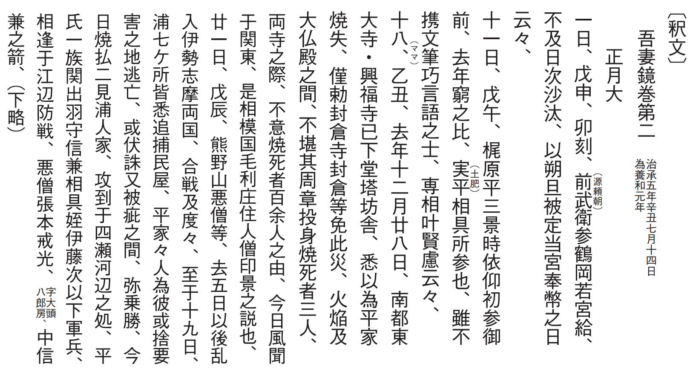
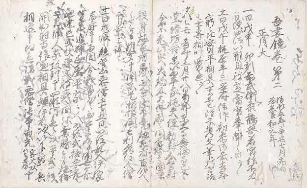

# 5　<ruby>南<rt>な</rt></ruby><ruby>無<rt>む</rt></ruby><ruby>阿<rt>あ</rt></ruby><ruby>弥<rt>み</rt></ruby><ruby>陀<rt>だ</rt></ruby><ruby>仏<rt>ぶつ</rt></ruby><ruby>作善集<rt>さぜんしゅう</rt></ruby>

<a href="../pdf/004.pdf" target="_blank">PDF</a>

Ｓ貴一七‐八。一巻。縦二九・四cm、全長一六五・〇cm。

吾妻鏡は、<ruby>治承<rt>じしょう</rt></ruby>四（一一八○）年の源頼朝挙兵前後から、<ruby>文<rt>ぶん</rt></ruby><ruby>永<rt>えい</rt></ruby>三（一二六六）年の将軍<ruby>宗尊<rt>むねたか</rt></ruby>親王の京都送還までの鎌倉幕府の歴史を<ruby>編<rt>へん</rt></ruby><ruby>年<rt>ねん</rt></ruby><ruby>体<rt>たい</rt></ruby>で記した全五二巻の史書。鎌倉時代の末までに成立か。活字本として新訂増補国史大系が使用されている。史料編纂所本は、室町幕府<ruby>奉行人<rt>ぶぎょうにん</rt></ruby><ruby>清<rt>しょう</rt></ruby><ruby>元<rt>もと</rt></ruby><ruby>定<rt>さだ</rt></ruby>（生没年不詳）の書写した抄出本で、現存は五巻分四冊のみ。室町時代の古写本は、本史料以外には数点しかない。元定は、吾妻鏡を武家の先例・<ruby>故<rt>こ</rt></ruby><ruby>実<rt>じつ</rt></ruby>の参考書として利用した。掲載したのは、第一冊の巻二冒頭。治承五（一一八一）年正月十一日条には、<ruby>梶<rt>かじ</rt></ruby><ruby>原<rt>わら</rt></ruby><ruby>景<rt>かげ</rt></ruby><ruby>時<rt>とき</rt></ruby>が<ruby>側<rt>そば</rt></ruby>近くに仕えるようになったことが記され、十八日条には、前年末の平家の南都（奈良）焼討ちが記される。廿一日条に見える<ruby>平信<rt>たいらののぶ</rt></ruby><ruby>兼<rt>かね</rt></ruby>は、元暦二年源頼朝袖判下文（３）にも見える。第一冊は、室町幕府の奉行人や<ruby>奉<rt>ほう</rt></ruby><ruby>公衆<rt>こうしゅう</rt></ruby>から元定への書状などを<ruby>反<rt>ほ</rt></ruby><ruby>故<rt>ご</rt></ruby>にして書かれている。〔参考〕前川祐一郎「室町時代における『吾妻鏡』」（『明月記研究』五、二○○○）。

 

<figure>
    
</figure>

 

<figure>
    
</figure>