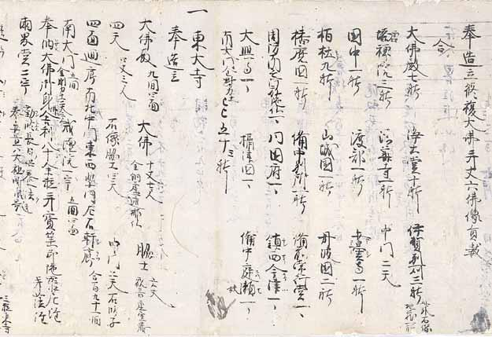

# 5　<ruby>南<rt>な</rt></ruby><ruby>無<rt>む</rt></ruby><ruby>阿<rt>あ</rt></ruby><ruby>弥<rt>み</rt></ruby><ruby>陀<rt>だ</rt></ruby><ruby>仏<rt>ぶつ</rt></ruby><ruby>作善集<rt>さぜんしゅう</rt></ruby>

<a href="../pdf/005.pdf" target="_blank">PDF</a>

Ｓ貴一七‐八。一巻。縦二九・四cm、全長一六五・〇cm。

<ruby>俊乗房重源<rt>しゅんじょうぼうちょうげん</rt></ruby>（一一二一〜一二○六）が、晩年の<ruby>建<rt>けん</rt></ruby><ruby>仁<rt>にん</rt></ruby>三（一二○三）年頃、自らの作善（仏教において<ruby>功<rt>く</rt></ruby><ruby>徳<rt>どく</rt></ruby>があるとされる<ruby>行業<rt>ぎょうごう</rt></ruby>）を記した一種の自伝で、自筆ともいわれる。重源は武士の子として生まれ、<ruby>醍<rt>だい</rt></ruby><ruby>醐<rt>ご</rt></ruby><ruby>寺<rt>じ</rt></ruby>で出家し法華経修行に励む<ruby>持経者<rt>じきょうじゃ</rt></ruby>となり、念仏信仰にもしたがった。「南無阿弥陀仏」とは、念仏信仰による自称。平氏に焼き討ちされた東大寺（４吾妻鏡参照）の復興のため人々に<ruby>勧<rt>かん</rt></ruby><ruby>進<rt>じん</rt></ruby>を行った。<ruby>後<rt>ご</rt></ruby><ruby>白<rt>しら</rt></ruby><ruby>河<rt>かわ</rt></ruby><ruby>法<rt>ほう</rt></ruby><ruby>皇<rt>おう</rt></ruby>や源頼朝の支援も得た。作善集には、東大寺や別所（宗教活動の拠点）の造営、中国の<ruby>阿<rt>あ</rt></ruby><ruby>育<rt>いく</rt></ruby><ruby>王<rt>おう</rt></ruby><ruby>山<rt>ざん</rt></ruby>に<ruby>舎<rt>しゃ</rt></ruby><ruby>利<rt>り</rt></ruby><ruby>殿<rt>でん</rt></ruby>建設のため材木を送ったこと、人々に阿弥陀仏号を授けたことなどが記される。掲載部分には、修造した<ruby>伽<rt>が</rt></ruby><ruby>藍<rt>らん</rt></ruby>・仏像の目録と東大寺造営が記される。<ruby>紙<rt>し</rt></ruby><ruby>背<rt>はい</rt></ruby>は「備前国麦進未并納所所下惣散用状」で、重源が東大寺復興の財源として賜った<ruby>知行国<rt>ちぎょうこく</rt></ruby><ruby>備前国<rt>びぜんのくに</rt></ruby>の麦収納に関する文書。〔参考〕『大日本史料』四‐九、建永元年六月四日条（重源伝）。奈良国立文化財研究所『南無阿弥陀仏作善集』（真陽社、一九五五）。小林剛編『俊乗房重源史料集成』（吉川弘文館、一九六五）。小林剛『俊乗房重源の研究』（有隣堂、一九八〇改版）。（重要文化財）

 

<figure>
    
</figure>