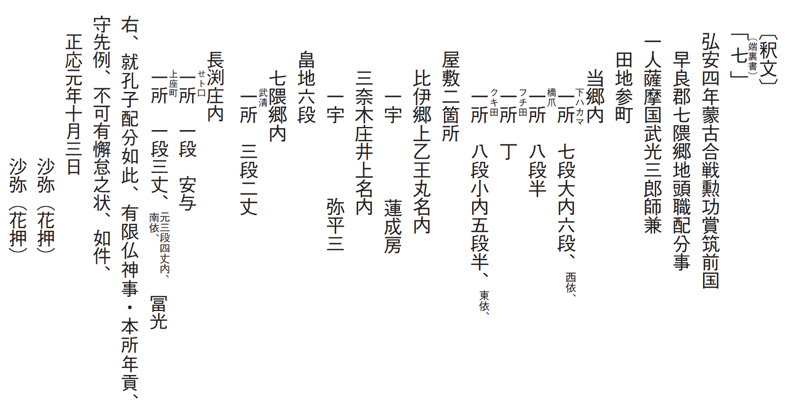
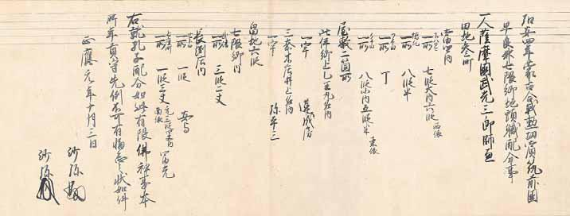

# 6　<ruby>蒙<rt>もう</rt></ruby><ruby>古<rt>こ</rt></ruby><ruby>合戦<rt>かっせん</rt></ruby><ruby>勲<rt>くん</rt></ruby><ruby>功<rt>こう</rt></ruby><ruby>配分状<rt>はいぶんじょう</rt></ruby>（<ruby>入<rt>いり</rt></ruby><ruby>来<rt>き</rt></ruby><ruby>院<rt>いん</rt></ruby><ruby>家<rt>け</rt></ruby><ruby>文<rt>もん</rt></ruby><ruby>書<rt>じょ</rt></ruby>）

<a href="../pdf/006.pdf" target="_blank">PDF</a>

Ｓ○六七一‐一八‐一八。一通。縦二九・〇cm、横八七・四cm。

入来院家文書は、<ruby>薩<rt>さつ</rt></ruby><ruby>摩<rt>まの</rt></ruby><ruby>国<rt>くに</rt></ruby>入来院の地頭入来院家に伝来した文書。入来院氏は、元来は<ruby>相<rt>さが</rt></ruby><ruby>模<rt>みの</rt></ruby><ruby>国<rt>くに</rt></ruby><ruby>渋<rt>しぶ</rt></ruby><ruby>谷荘<rt>やのしょう</rt></ruby>の地頭の渋谷氏であったが、宝治元（一二四七）年の、<ruby>宝<rt>ほう</rt></ruby><ruby>治<rt>じ</rt></ruby><ruby>合<rt>かっ</rt></ruby><ruby>戦<rt>せん</rt></ruby>（北条氏と三浦氏の戦闘）における勲功で渋谷<ruby>定心<rt>じょうしん</rt></ruby>が恩賞として入来院を与えられ、のちに子孫が入来院に移住し、入来院の家名を称した。入来院家文書は、一九二九年に米国イエール大学の<ruby>朝<rt>あさ</rt></ruby><ruby>河<rt>かわ</rt></ruby><ruby>貫<rt>かん</rt></ruby><ruby>一<rt>いち</rt></ruby>が英訳し紹介したので、日本中世史料として世界的に知られることになった。史料編纂所のデータベースで画像・釈文・英文を閲覧できる。正応元（一二八八）年十月三日蒙古合戦勲功配分状は、御家人<ruby>武<rt>たけ</rt></ruby><ruby>光<rt>みつ</rt></ruby>氏が<ruby>弘<rt>こう</rt></ruby><ruby>安<rt>あん</rt></ruby>の<ruby>役<rt>えき</rt></ruby>（弘安四（一二八一）年）に従軍した恩賞として与えられたもの。武光<ruby>師<rt>もろ</rt></ruby><ruby>兼<rt>かね</rt></ruby>は薩摩国<ruby>高<rt>た</rt></ruby><ruby>城<rt>き</rt></ruby>郡<ruby>吉<rt>よし</rt></ruby><ruby>枝名<rt>えだみょう</rt></ruby>を拠点とする御家人。<ruby>鎮<rt>ちん</rt></ruby><ruby>西<rt>ぜい</rt></ruby>奉行として文永・弘安両度の合戦を指揮した<ruby>大<rt>おお</rt></ruby><ruby>友<rt>とも</rt></ruby><ruby>頼<rt>より</rt></ruby><ruby>泰<rt>やす</rt></ruby>と<ruby>少弐<rt>しょうに</rt></ruby><ruby>経<rt>つね</rt></ruby><ruby>資<rt>すけ</rt></ruby>が連署する<ruby>孔<rt>く</rt></ruby><ruby>子<rt>じ</rt></ruby>配分状の形式をとっている。孔子は限られた恩賞地を公平に配分するための措置。〔参考〕相田二郎『蒙古襲来の研究』増補版（吉川弘文館、一九八二）。

<figure>
    
</figure>

 

<figure>
    
</figure>