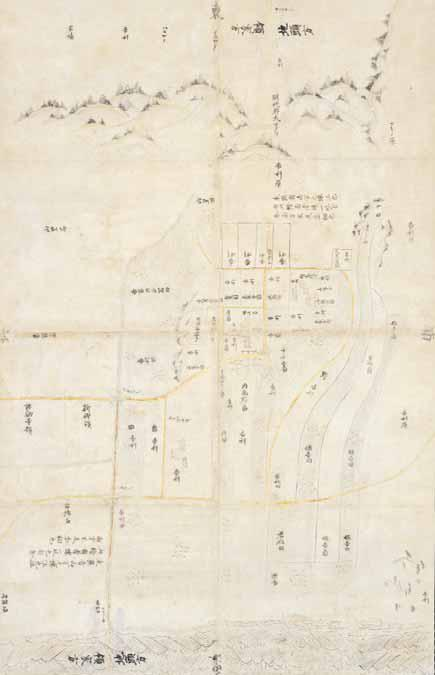

# 7　<ruby>薩<rt>さつ</rt></ruby><ruby>摩<rt>まの</rt></ruby><ruby>国<rt>くに</rt></ruby><ruby>日<rt>ひ</rt></ruby><ruby>置<rt>おき</rt></ruby><ruby>北<rt>きた</rt></ruby><ruby>郷<rt>ごう</rt></ruby><ruby>下<rt>した</rt></ruby><ruby>地中分<rt>じちゅうぶん</rt></ruby><ruby>図<rt>ず</rt></ruby>（重要文化財）

<a href="../pdf/007.pdf" target="_blank">PDF</a>

仁‐一○八。一幅。縦一二五・八cm、横一○五・二cm。紙本彩色。

日置北郷の下地中分を描いた図。島津荘に属する日置北郷は、現在の鹿児島県日置市に位置する。荘園領主は、<ruby>本<rt>ほん</rt></ruby><ruby>所<rt>じょ</rt></ruby>が<ruby>近<rt>この</rt></ruby><ruby>衛<rt>え</rt></ruby>家、<ruby>領家<rt>りょうけ</rt></ruby>が<ruby>興<rt>こう</rt></ruby><ruby>福<rt>ふく</rt></ruby><ruby>寺<rt>じ</rt></ruby><ruby>一乗<rt>いちじょう</rt></ruby><ruby>院<rt>いん</rt></ruby>で、郡司の系譜をひく薩摩平氏一族が下司として支配を行っていた。一方、地頭島津氏が勢力を伸ばし、鎌倉後期には庶流の<ruby>伊<rt>い</rt></ruby><ruby>作<rt>さく</rt></ruby>島津氏が地頭職を相伝していた。領家・<ruby>下<rt>げ</rt></ruby><ruby>司<rt>す</rt></ruby>と地頭の対立は弘安年間（一二七八〜八八）以降頻発し、<ruby>元<rt>げん</rt></ruby><ruby>亨<rt>こう</rt></ruby>四（一三二四）年、日置北郷は下地中分された。中分絵図は、<ruby>和<rt>わ</rt></ruby><ruby>与状<rt>よじょう</rt></ruby>（紛争の和解契約状）と共に、領家方<ruby>雑掌<rt>ざっしょう</rt></ruby>と<ruby>地<rt>じ</rt></ruby><ruby>頭<rt>とう</rt></ruby><ruby>代<rt>だい</rt></ruby>との間で作成された。裏面には、中分線を挟んで雑掌と地頭代が署判を据え線を確定した。中分により、北側が領家の、南側が地頭の一円支配地となり、年貢、<ruby>公<rt>く</rt></ruby><ruby>事<rt>じ</rt></ruby>などは双方に振り分けられた。史料編纂所では、荘園絵図の精細な図版を集成した『日本荘園絵図聚影』を編纂している。〔参考〕『大日本古文書』島津家文書之一、五五○・六○五号。『日本荘園絵図聚影』五下。黒田日出男「領主の争いと荘園の分割」（小山靖憲・佐藤和彦編『絵図にみる荘園の世界』東京大学出版会、一九八七）。

 

<figure>
    
</figure>