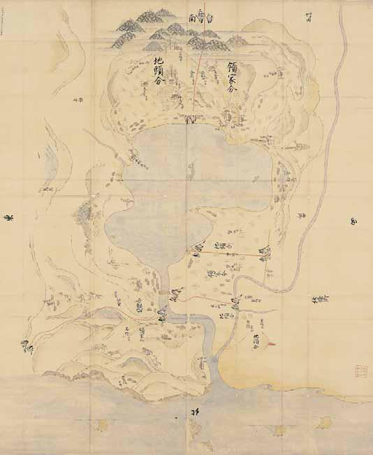

# 8　<ruby>伯<rt>ほう</rt></ruby><ruby>耆<rt>きの</rt></ruby><ruby>国<rt>くに</rt></ruby><ruby>東<rt>とう</rt></ruby><ruby>郷荘<rt>ごうのしょう</rt></ruby><ruby>下<rt>した</rt></ruby><ruby>地中<rt>じちゅう</rt></ruby><ruby>分<rt>ぶん</rt></ruby><ruby>絵<rt>え</rt></ruby><ruby>図<rt>ず</rt></ruby>（<ruby>模<rt>も</rt></ruby><ruby>写<rt>しゃ</rt></ruby><ruby>本<rt>ぼん</rt></ruby>）

<a href="../pdf/008.pdf" target="_blank">PDF</a>

仁‐一○八。一幅。縦一二五・八cm、横一○五・二cm。紙本彩色。

<ruby>松尾<rt>まつのお</rt></ruby>神社<ruby>主典<rt>しゅてん</rt></ruby><ruby>東<rt>ひがし</rt></ruby>房経所蔵本（現在、柳沢氏所蔵）の模写本。原本は、中世荘園の下地中分の実際を示す図として教科書にも掲載され有名な絵図。原本は<ruby>正嘉<rt>しょうか</rt></ruby>二（一二五八）年十一月作成（裏書）で、領家の松尾神社に伝来した。絵図は、南を天にして、鳥取県中部の<ruby>潟<rt>かた</rt></ruby><ruby>湖<rt>この</rt></ruby><ruby>東<rt>とう</rt></ruby><ruby>郷<rt>ごう</rt></ruby><ruby>池<rt>いけ</rt></ruby>（湯梨浜町）を中心に描く。池の西北の小山に西の北条郷との<ruby>牓<rt>ぼう</rt></ruby><ruby>示<rt>じ</rt></ruby>（堺の標識）が描かれる。池の西には水田が広がる。西南の大杉も境界の目印と思われる。南の深山は、<ruby>三<rt>み</rt></ruby><ruby>朝郷<rt>ささごう</rt></ruby>との境界をなす。池の東南には加那子社と小川があり、東の山に鎮座する伯耆<ruby>一宮<rt>いちのみ</rt></ruby>や（<ruby>倭文<rt>しとり</rt></ruby>神社）との境界となる。一宮から東北に広がる山地は馬野（放牧地）で馬が放牧されている。池は橋津川で日本海につながる。海には帆掛舟が三隻走る。橋津川の河口には大湊宮（<ruby>湊神<rt>みなと</rt></ruby>社）が鎮座し、津があった。東郷荘の日本海海上交通との関わりがうかがわれる。東郷荘を構成する田畠・放牧地・池・湊・寺社などのそれぞれを「領家分」と「地頭分」に等分するために四本の朱線が引かれている。〔参考〕『日本荘園絵図聚影』五上。松尾容孝「伯耆国東郷荘下地中分絵図【東大模写本】」（『中世荘園絵図大成』第一部、河出書房新社、一九九七）。

 

<figure>
    
</figure>