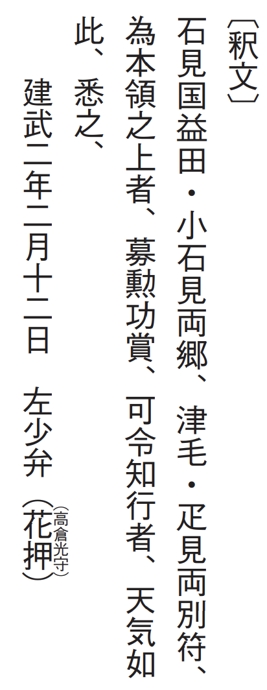
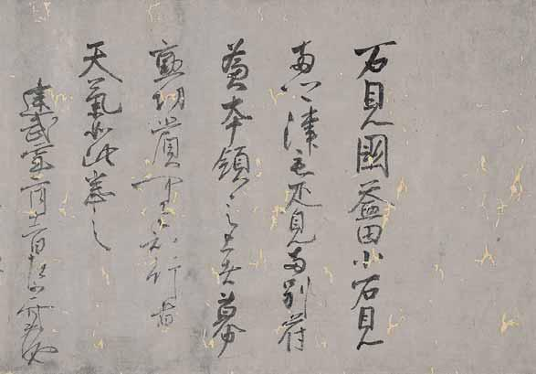

# 9　<ruby>後<rt>ご</rt></ruby><ruby>醍<rt>だい</rt></ruby><ruby>醐<rt>ご</rt></ruby><ruby>天<rt>てん</rt></ruby><ruby>皇<rt>のう</rt></ruby><ruby>綸<rt>りん</rt></ruby><ruby>旨<rt>じ</rt></ruby>（<ruby>益<rt>ます</rt></ruby><ruby>田<rt>だ</rt></ruby><ruby>家<rt>け</rt></ruby><ruby>文<rt>もん</rt></ruby><ruby>書<rt>しょ</rt></ruby>）

<a href="../pdf/009.pdf" target="_blank">PDF</a>

Ｓ益田家文書‐○‐四。一通。縦三○・六cm、横四四・二cm。

益田家文書は、<ruby>石<rt>いわ</rt></ruby><ruby>見<rt>みの</rt></ruby><ruby>国<rt>くに</rt></ruby><ruby>益<rt>ます</rt></ruby><ruby>田荘<rt>だのしょう</rt></ruby>（島根県益田市）を中心とする武士団益田氏に伝来した武家文書。益田氏は、戦国時代に毛利氏に従い、近世には<ruby>萩<rt>はぎ</rt></ruby><ruby>藩家<rt>か</rt></ruby><ruby>老<rt>ろう</rt></ruby>を勤めた。<ruby>建<rt>けん</rt></ruby><ruby>武<rt>む</rt></ruby>二（一三三五）年二月十二日後醍醐天皇綸旨は、後醍醐天皇（一二八八〜一三三九）が益田家に出した本領aaa<ruby>安堵<rt>あんど</rt></ruby>の文書。鎌倉幕府を倒し公家一統の政治を目指した後醍醐天皇は、天皇の意思を直接的に示す綸旨を多用した。この文書の奥（左端）は<ruby>宛所<rt>あてどころ</rt></ruby>（文書の受取人）の書かれていたところが切除されている（墨跡がわずかに残る）。宛所には南北朝内乱期に滅亡した益田総領家の名が記されていたと推定され、内乱期の武士の家の動向がうかがわれる。〔参考〕『大日本古文書』益田家文書之一、一八号。林譲「後醍醐天皇綸旨」（『東京大学史料編纂所報』二五、一九九○）。

<figure>
    
</figure>

 

<figure>
    
</figure>