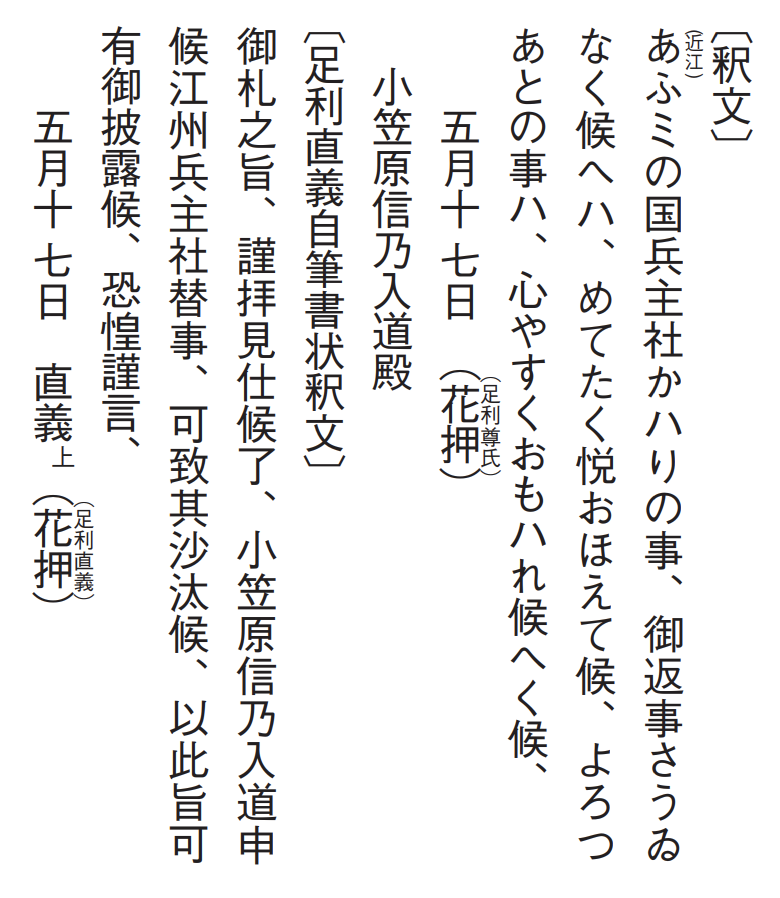
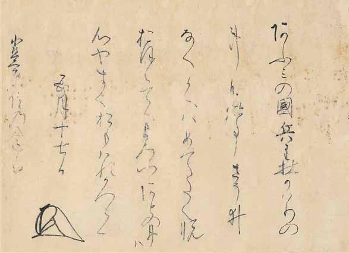

# 10　<ruby>足<rt>あし</rt></ruby><ruby>利<rt>かが</rt></ruby><ruby>尊<rt>たか</rt></ruby><ruby>氏<rt>うじ</rt></ruby><ruby>自筆書状<rt>じひつしょじょう</rt></ruby>（<ruby>小笠原<rt>おがさわら</rt></ruby><ruby>文<rt>もん</rt></ruby><ruby>書<rt>じょ</rt></ruby>）

<a href="../pdf/010.pdf" target="_blank">PDF</a>

Ｓ○六七一‐一七‐一‐一一。一通。縦三一・八cm、横四四・二cm。

小笠原文書は、<ruby>信濃<rt>しなの</rt></ruby>中部の松本地域を中心にして繁栄し、信濃<ruby>守<rt>しゅ</rt></ruby><ruby>護職<rt>ごしょく</rt></ruby>も勤めた小笠原家の文書で、<ruby>越<rt>えち</rt></ruby><ruby>前<rt>ぜん</rt></ruby><ruby>勝<rt>かつ</rt></ruby><ruby>山<rt>やま</rt></ruby>小笠原家に伝来したものである。代々の室町幕府将軍の<ruby>御教<rt>みぎょう</rt></ruby><ruby>書<rt>しょ</rt></ruby>をはじめとして、点数は一八○余に及ぶ。（貞和三（一三四七）年）五月十七日足利尊氏自筆書状は、釈文を掲げた同月日足利<ruby>直<rt>ただ</rt></ruby><ruby>義<rt>よし</rt></ruby>自筆書状と一連のものである。小笠原<ruby>貞<rt>さだ</rt></ruby><ruby>宗<rt>むね</rt></ruby>（<ruby>法名<rt>ほうみょう</rt></ruby>、正宗）は<ruby>近<rt>おう</rt></ruby><ruby>江<rt>み</rt></ruby>の<ruby>国<rt>くに</rt></ruby><ruby>兵主社<rt>ひょうずしゃ</rt></ruby>（滋賀県野洲市五条）の替地を尊氏に申請し、尊氏は弟の直義に仲介した。政務を譲り受けていた直義はこれを許可し、その旨を尊氏に伝えた。これが直義書状である。これを受け、尊氏が貞宗に対して直義の返事の相異なき旨を伝えたものが尊氏書状である。貞宗は貞和三年五月二十六日に没した。尊氏は自筆にて「よろつあとの事ハ心やすくおもハれ候」と記し死没直前の貞宗の希望をかなえている。〔参考〕信濃史料刊行会編『信濃史料』五（一九五四）、同編『新編信濃史料叢書』一二（一九七五）。

<figure>
    
</figure>

 

<figure>
    
</figure>