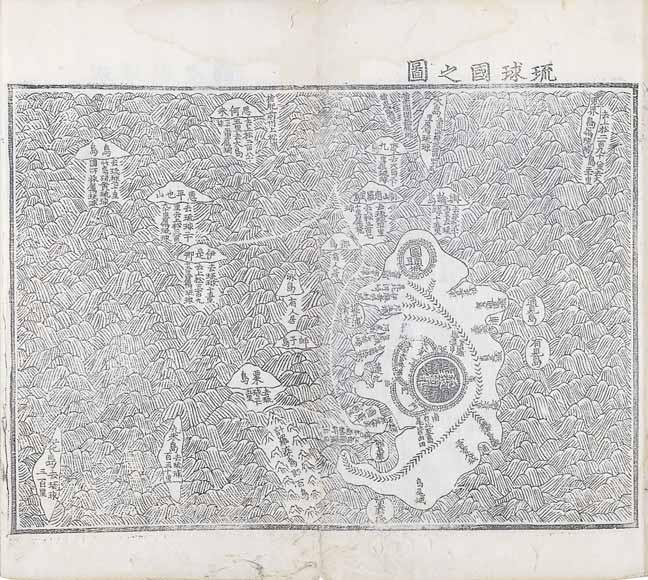

# 11　<ruby>海東<rt>かいとう</rt></ruby><ruby>諸国<rt>しょこく</rt></ruby><ruby>紀<rt>き</rt></ruby>

<a href="../pdf/011.pdf" target="_blank">PDF</a>

Ｓ貴二三‐二。一冊。縦三二・六cm、横二一・二cm。

朝鮮・<ruby>申叔舟<rt>シンスクチュ</rt></ruby>編。朝鮮活字版。成化七（成宗二・一四七一）年序。朝鮮<ruby>成<rt>せい</rt></ruby><ruby>宗<rt>そう</rt></ruby>二年に王命により申叔舟（一四一七〜七五）が編纂した、海東諸国（日本国・琉球国）の歴史・地理・風俗・言語や朝鮮との通交について記した書。地図・日本国紀・琉球国紀・朝<ruby>聘<rt>へい</rt></ruby><ruby>応<rt>おう</rt></ruby><ruby>接<rt>せつ</rt></ruby><ruby>紀<rt>き</rt></ruby>・附録からなる。海東諸国の地図や、琉球語をハングルにおきかえた語音翻訳などを収める。日本の風俗について、食事に漆器と箸を使うことや、お歯黒の風習を記す。史料編纂所本は、一六世紀初頭の古版本。掲載した琉球国図は、一五世紀中葉の時期の様子を伝える。肥前の松浦を通る朝鮮との航路などが記され、奄美諸島や<ruby>慶<rt>け</rt></ruby><ruby>良<rt>ら</rt></ruby><ruby>間<rt>ま</rt></ruby>諸島なども描かれる。琉球本島の中心の円形の城郭「琉球国都」が<ruby>首<rt>しゅ</rt></ruby><ruby>里城<rt>りじょう</rt></ruby>。〔参考〕田中健夫訳注『海東諸国紀』（岩波書店、一九九一）。

 

<figure>
    
    <figcaption>琉球国之図</figcaption>
</figure>