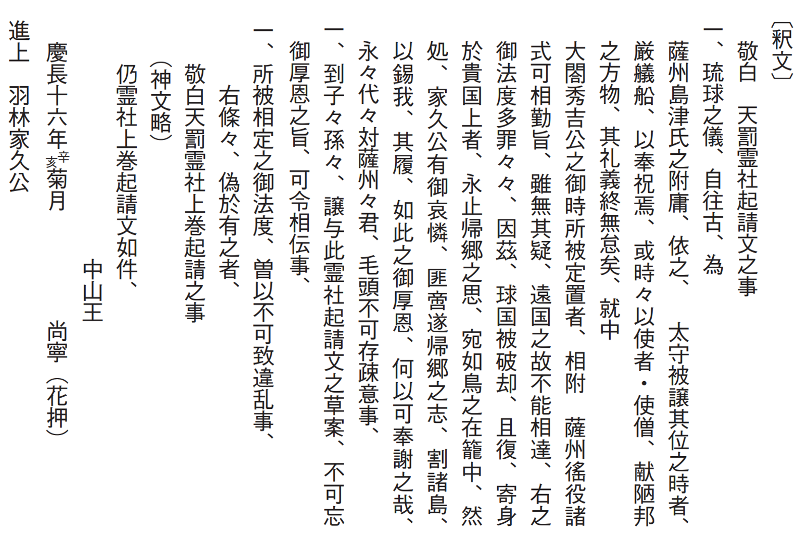
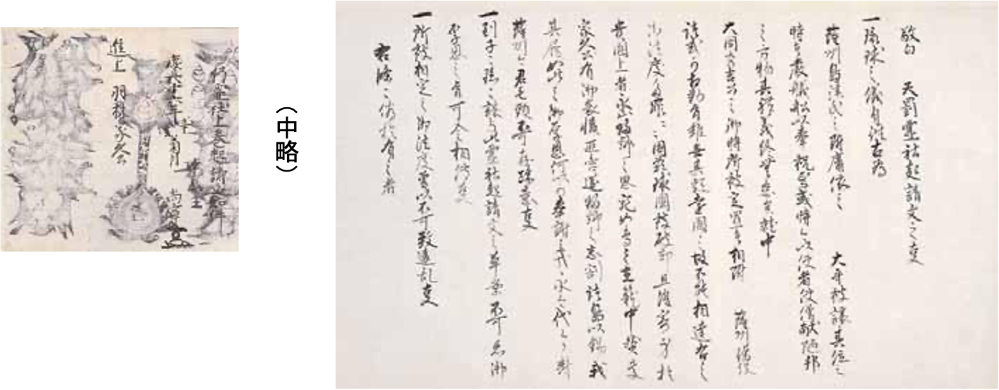

# 12　<ruby>琉球国中山<rt>りゅうきゅうこくちゅうざん</rt></ruby><ruby>王尚寧<rt>おうしょうねい</rt></ruby><ruby>起請文<rt>きしょうもん</rt></ruby>（<ruby>島<rt>しま</rt></ruby><ruby>津<rt>づ</rt></ruby><ruby>家<rt>け</rt></ruby><ruby>文<rt>もん</rt></ruby><ruby>書<rt>じょ</rt></ruby>）（国宝）

<a href="../pdf/012.pdf" target="_blank">PDF</a>

Ｓ島津家文書‐五‐七。続つぎ紙がみ、一通。第一紙、縦三五・九cm、横六二・一cm。

慶長十四（一六○九）年、島津家は徳川家康の許可を得て琉球に出兵し征服した。降伏した国王尚寧以下百余名を鹿児島へ連行し、東上し家康、<ruby>秀<rt>ひで</rt></ruby><ruby>忠<rt>ただ</rt></ruby>に拝謁させた。慶長十六年九月琉球国中山王尚寧起請文は、鹿児島に戻った尚寧が、琉球国を薩摩藩主島津<ruby>家<rt>いえ</rt></ruby><ruby>久<rt>ひさ</rt></ruby>から安堵され、帰国の前に家久に宛てて差し出した起請文である。月のみで日付の記載はないが、九月十九日に薩摩側が政治指針である「<ruby>掟<rt>おきて</rt></ruby>十五条」を琉球側に示し、同二十一日に<ruby>勝連親方<rt>かつれんうえーかた</rt></ruby>外五名連署の起請文が提出されているので、この間の作成と考えられる。起請文への署名を拒否した<ruby>三<rt>さん</rt></ruby><ruby>司<rt>し</rt></ruby><ruby>官<rt>かん</rt></ruby>の一人<ruby>謝<rt>じゃ</rt></ruby><ruby>名<rt>な</rt></ruby><ruby>利<rt>り</rt></ruby><ruby>山<rt>さん</rt></ruby>（<ruby>唐<rt>から</rt></ruby><ruby>名<rt>な</rt></ruby>、<ruby>鄭<rt>てい</rt></ruby><ruby>迥<rt>どう</rt></ruby>）は<ruby>斬<rt>ざん</rt></ruby><ruby>首<rt>しゅ</rt></ruby>になった。起請文は、あることがらを宣誓し、万一その内容に偽りがあれば神仏の罰を蒙るであろうと述べた文書。宣誓の部分を前書、神仏の名をあげて呪詛をかけた部分を<ruby>神<rt>しん</rt></ruby><ruby>文<rt>もん</rt></ruby>と称す。神文の<ruby>料紙<rt>りょうし</rt></ruby>には、<ruby>牛<rt>ご</rt></ruby><ruby>王<rt>おう</rt></ruby><ruby>宝<rt>ほう</rt></ruby><ruby>印<rt>いん</rt></ruby>（護符）を裏返して使うことが行われた。この文書も、神文に熊野那智神社の<ruby>那<rt>な</rt></ruby><ruby>智<rt>ち</rt></ruby><ruby>瀧<rt>だき</rt></ruby><ruby>宝<rt>ほう</rt></ruby><ruby>印<rt>いん</rt></ruby>（「那智瀧宝印」の文字を<ruby>烏<rt>う</rt></ruby><ruby>点<rt>てん</rt></ruby>と<ruby>宝<rt>ほう</rt></ruby><ruby>珠<rt>じゅ</rt></ruby>で表現したもの）七枚を使用する。「身を貴国に寄するの上は、永く帰郷の思を止めて、宛あたかも鳥の籠の中にあるが如し」の一文に尚寧の無念さを読み取れるか。

<figure>
    
</figure>

 

<figure>
    
</figure>