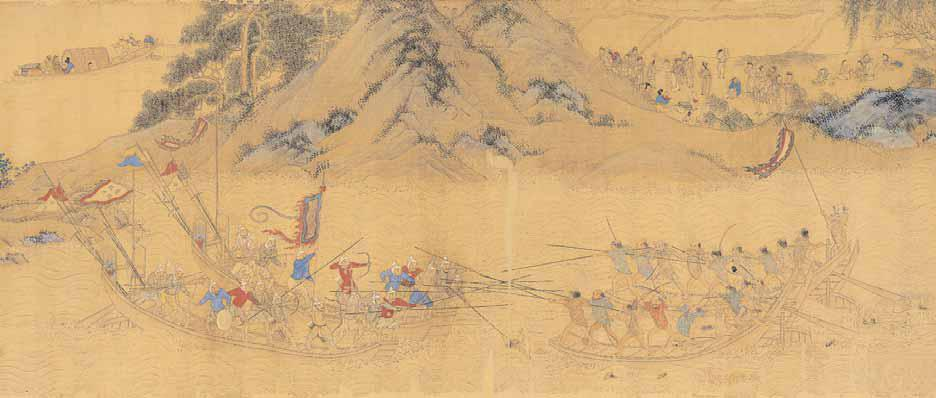

# 13 <ruby>倭<rp>(</rp><rt>わ</rt><rp>)</rp></ruby><ruby>寇<rp>(</rp><rt>こう</rt><rp>)</rp></ruby><ruby>図<rp>(</rp><rt>ず</rt><rp>)</rp></ruby><ruby>巻<rp>(</rp><rt>かん</rt><rp>)</rp></ruby>

Ｓ〇〇八〇‐二。一巻。縦三二・〇cm、全長五二三・〇cm。絹本着色。

<ruby>題<rp>(</rp><rt>だい</rt><rp>)</rp></ruby><ruby>箋<rp>(</rp><rt>せん</rt><rp>)</rp></ruby>に「<ruby>明仇十洲<rp>(</rp><rt>みんきゅうじゅっしゅう</rt><rp>)</rp></ruby><ruby>台<rp>(</rp><rt>たい</rt><rp>)</rp></ruby><ruby>湾<rp>(</rp><rt>わん</rt><rp>)</rp></ruby><ruby>奏<rp>(</rp><rt>そう</rt><rp>)</rp></ruby><ruby>凱<rp>(</rp><rt>がい</rt><rp>)</rp></ruby><ruby>図<rp>(</rp><rt>ず</rt><rp>)</rp></ruby>」とあり、一六世紀前半の明の画家<ruby>仇英<rp>(</rp><rt>きゅうえい</rt><rp>)</rp></ruby>が描いた台湾討伐成功の図とする。しかし、画題・色調から仇英の作品ではないとされる。内容も台湾討伐成功の図ではなく、兵士と戦う者の武器が日本刀で、<ruby>甲胄<rp>(</rp><rt>かっちゅう</rt><rp>)</rp></ruby>を着た者の<ruby>兜<rp>(</rp><rt>かぶと</rt><rp>)</rp></ruby>が日本風であることから、倭寇を描いた図として「倭寇図巻」と呼ばれるようになった。倭寇とは、中世、朝鮮半島や中国大陸など東アジアの広い地域で活動した、日本人を含む海賊のこと。一四〜一五世紀に活動した前期倭寇と、一六世紀に活動した後期倭寇とがある。鉄砲を持つ倭寇が描かれているので、後期倭寇を描いたとされる。倭寇の写実的な姿を伝える唯一の絵画史料として価値が高い。〔参考〕『倭寇図巻』（近藤出版社、一九七四）。田中健夫『中世対外関係史』（東京大学出版会、一九七五）。

 

**13 倭寇図巻** 明兵と倭冦の戦闘

 

    <a target="_blank" href="https://nakamura196.github.io/cp/">全画面表示</a>

<iframe src="https://nakamura196.github.io/cp/" width="100%" height="600px" frameBorder="0"></iframe>