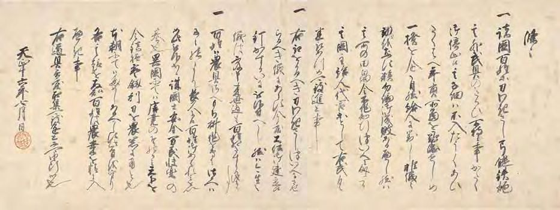

# 14　<ruby>豊<rt>とよ</rt></ruby><ruby>臣<rt>とみ</rt></ruby><ruby>秀<rt>ひで</rt></ruby><ruby>吉<rt>よし</rt></ruby><ruby>掟書<rt>おきてがき</rt></ruby>・<ruby>刀狩令<rt>かたながりれい</rt></ruby>（<ruby>島<rt>しま</rt></ruby><ruby>津<rt>づ</rt></ruby><ruby>家<rt>け</rt></ruby><ruby>文<rt>もん</rt></ruby><ruby>書<rt>じょ</rt></ruby>）（国宝）

<a href="../pdf/014.pdf" target="_blank">PDF</a>

Ｓ島津家文書‐二‐一六‐一〇。一通。縦四八・二cm、横一三○・二cm。

天正十六（一五八八）年七月、豊臣秀吉が薩摩国の大名島津氏に宛てたもので、刀狩令の<ruby>正文<rt>しょうもん</rt></ruby> 。第一条は、百姓は武器があるために領主に反抗し年貢を納めなくなるので、百姓の持つ弓・<ruby>鑓<rt>やり</rt></ruby>・<ruby>鉄<rt>てっ</rt></ruby><ruby>炮<rt>ぽう</rt></ruby>などを没収することを命じる。第二条では、没収した武器のつかいみちについて、大仏（京都の<ruby>方<rt>ほう</rt></ruby><ruby>広<rt>こう</rt></ruby><ruby>寺<rt>じ</rt></ruby>の大仏）建立に用いることを述べる。第三条は、百姓は農具をもち耕作に専念すべきことを述べる。刀狩令は、全国に一斉に発令されたものと考えられ、<ruby>小<rt>こ</rt></ruby><ruby>早<rt>ばや</rt></ruby><ruby>川<rt>かわ</rt></ruby>家文書などにも残る。〔参考〕『大日本古文書』島津家文書之一、三五三号。藤木久志『豊臣平和令と戦国社会』（東京大学出版会、一九八五）。

〔釈文〕 条々 一、諸国百姓等、刀・わきさし・弓・鑓・鉄炮、其外武具のたくひ所持候事、かたく御停止候、其子細ハ、不入たうくあひたくはへ、年貢所当を難渋せしめ、一揆を企、自然給人に対し非儀之動をなす族、勿論御成敗あるへし、然ハ其所の田畠令不作、知行ついへに成候間、其国主・給人・代官等として、右武具悉取あつめ、可致進上事、 一、右取をかるへき刀・わきさし、ついへにさせらるへき儀にあらす、今度大仏御建立候釘・かすかいに被仰付へし、然ハ今生之儀は不及申、来世迄も百姓相たすかる儀に候事、 一、百姓ハ農具さへもち、耕作を専に仕候へハ、子々孫々まて長久に候、百姓御あはれミを以、如此被仰出候、誠国土安全、万民快楽の基也、異国にてハ唐尭のそのかミ、天下を令鎮撫、宝利〔剱〕刀を農器に用と也、本朝にてハためしあるへからす、此旨を守り、各其趣を存知、百姓は農桑を精に入へき事、 右道具、急度取集、可致進上、不可由断候也、 天正十六年七月日（朱印（豊臣秀吉）

</img>

 

<figure>
    </img>
</figure>