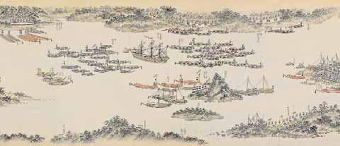

# 15　ロシア<ruby>使<rt>し</rt></ruby><ruby>節<rt>せつ</rt></ruby>レザノフ<ruby>来<rt>らい</rt></ruby><ruby>航<rt>こう</rt></ruby><ruby>絵<rt>え</rt></ruby><ruby>巻<rt>まき</rt></ruby>

<a href="../pdf/015.pdf" target="_blank">PDF</a>

Ｓ○○五一‐一。二巻。縦四〇・八cm。紙本着色。

文化元（一八○四）年に、ロシア使節ニコライ・Ｐ・レザノフ（一七六四〜一八○七）が、長崎に来航した時の光景を描いた絵巻。レザノフは、ロシア皇帝の国書と、<ruby>寛<rt>かん</rt></ruby><ruby>政<rt>せい</rt></ruby>四（一七九二）年ラクスマンが来航した時に与えられた<ruby>信<rt>しん</rt></ruby><ruby>牌<rt>ぱい</rt></ruby>を携えて、文化元（一八○四）年九月に来航、通交・通商を要求したが、翌年三月幕府<ruby>目<rt>め</rt></ruby><ruby>付<rt>つけ</rt></ruby>遠山<ruby>景<rt>かげ</rt></ruby><ruby>晋<rt>みち</rt></ruby>より通商を認めない旨の諭書を渡されて、国書も受理されないまま長崎を去った。上巻は、レザノフの乗船ナデジダ号が長崎湾に入港する経過を表し、下巻は、レザノフが遠山と会見するため長崎奉行所に向かう様子を描く。長崎奉行所の外観、福岡藩・佐賀藩・大村藩の警備の様子、番所や番船も描かれる。

 

<figure>
    
    <figcaption>ロシア人の図</figcaption>
</figure>

<figure>
    
    <figcaption>ナデジダ号</figcaption>
</figure>

<figure>
    
    <figcaption>長崎湾の警護</figcaption>
</figure>