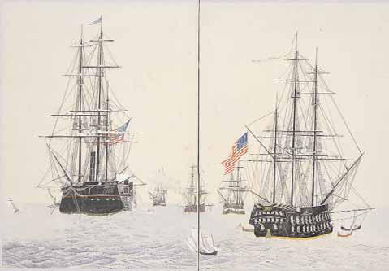
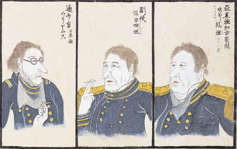

# 16　ペリー<ruby>渡<rt>と</rt></ruby><ruby>来<rt>らい</rt></ruby><ruby>絵<rt>え</rt></ruby><ruby>図<rt>ず</rt></ruby><ruby>貼<rt>はり</rt></ruby><ruby>交屏風<rt>まぜびょうぶ</rt></ruby>

<a href="../pdf/016.pdf" target="_blank">PDF</a>

Ｓ貴別架‐二。一隻（八曲）。縦一五二・五cm、横三八○・○cm。紙本着色。

米国特派全権使節・東インド艦隊司令官ペリー提督率いる蒸気艦隊は、嘉永六・七（一八五三・五四）年に二度来航し、幕府に開国を迫った。全国に未曾有の衝撃をもたらした大事件であった。黒船と呼ばれた艦船や、ペリー一行の姿が多数写生され流布した。史料編纂所の屏風には、艦船、人物、蒸気機関車や通信機などの図が貼り交ぜられている。掲載したのは、蒸気船と帆船からなる艦隊の光景、ペリー等の肖像画である。史料編纂所は、ペリー艦隊を実見し取材して描かれたと考えられるスケッチを含む、七○葉の絵を集めた「ペリー渡来絵図写生帖」も所蔵する。〔参考〕大久保利謙編『黒船来航譜』（毎日新聞社、一九八八）。

 

<figure>
    
    <figcaption>ペリー艦隊</figcaption>
</figure>

<figure>
    
    <figcaption>ウィリアムス / アダムス / ペリー</figcaption>
</figure>