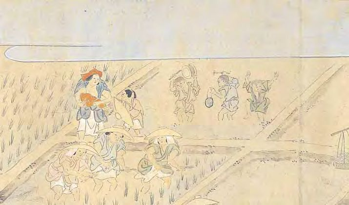

# 17 たはらかさね<ruby>耕<rp>(</rp><rt>こう</rt><rp>)</rp></ruby><ruby>作<rp>(</rp><rt>さく</rt><rp>)</rp></ruby><ruby>絵<rp>(</rp><rt>え</rt><rp>)</rp></ruby><ruby>巻<rp>(</rp><rt>まき</rt><rp>)</rp></ruby>

<a href="../pdf/017.pdf" target="_blank">PDF</a>

Ｓ ○○ 八 ○‐一。一巻。縦二八・七 cm、全長八一二・○cm。紙本着色。

戦国時代以降、農業の様相を描いたさまざまな絵画作品が制作された。本絵巻は、大名・武家の子弟に農業のありさまを学ばせるために作られたものとされる。「たはらかさね耕作」の首題をもつ<ruby>詞書<rp>(</rp><rt>ことばがき</rt><rp>)</rp></ruby>と、<ruby>土牛<rp>(</rp><rt>どぎゅう</rt><rp>)</rp></ruby>の祭、田の神祭、播種、田植、潅漑、祭礼踊、田草取、収穫、脱穀、年貢貢納、領主の館への収納、祝など一一段の農耕年中行事図からなる。成立年代・作者は不明であるが、室町末期から江戸初期の時期に描かれたものと推定されている。侍の服装などの風俗表現も一六世紀頃のもので、古い形式の<ruby>十<rp>(</rp><rt>そ</rt><rp>)</rp></ruby><ruby>露<rp>(</rp><rt>ろ</rt><rp>)</rp></ruby><ruby>盤<rp>(</rp><rt>ばん</rt><rp>)</rp></ruby>（算盤）も描かれる。掲載したのは、田植の図。早乙女が苗を植え、童子が太鼓などで<ruby>囃<rp>(</rp><rt>はや</rt><rp>)</rp></ruby>す光景が描かれる。 〔参考〕加藤秀幸「『俵かさね耕作絵巻』考」（『東京大学史料編纂所研究紀要』三、一九九三）。

 

<figure>

    <figcaption>田植の図</figcaption>
</figure>

 

    <a target="_blank" href="http://codh.rois.ac.jp/software/iiif-curation-viewer/demo/?manifest=https://nakamura196.github.io/iiif0/iiif/tahara.json&xywh=40144,648,2352,1640&xywh_highlight=border">全画面表示</a>

<iframe allow="fullscreen" src="../icv/?manifest=https://nakamura196.github.io/iiif0/iiif/tahara.json&canvas=https://nakamura196.github.io/iiif0/iiif/tahara/canvas/p1#xywh=40144,648,2352,1640&xywh_highlight=border" width="100%" height="600px" frameBorder="0"></iframe>
