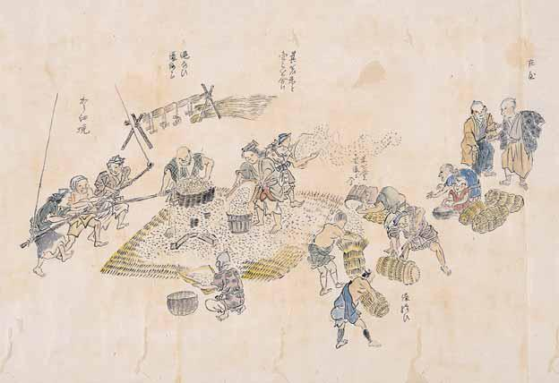

# 18　<ruby>老<rt>ろう</rt></ruby><ruby>農<rt>のう</rt></ruby><ruby>夜<rt>や</rt></ruby><ruby>話<rt>わ</rt></ruby>

<a href="../pdf/018.pdf" target="_blank">PDF</a>

○○九一‐一。一巻。縦三四cm。紙本着色。

老農夜話は、江戸時代後期の稲作農業絵巻で、種子の準備、<ruby>種<rt>たね</rt></ruby><ruby>浸<rt>ひたし</rt></ruby>の準備、種浸、<ruby>苗<rt>なわ</rt></ruby><ruby>代<rt>しろ</rt></ruby>作り、<ruby>種<rt>たね</rt></ruby><ruby>籾<rt>もみ</rt></ruby>の催芽、<ruby>種<rt>たね</rt></ruby><ruby>蒔<rt>まき</rt></ruby>、苗代田管理、本田耕起、田植え、草取り、用水管理、<ruby>坪<rt>つぼ</rt></ruby><ruby>刈<rt>がり</rt></ruby>（地方役人が巡回し収穫に先立ち収量を計測する徴租法）、稲刈り、脱穀、<ruby>籾<rt>もみ</rt></ruby><ruby>摺<rt>すり</rt></ruby>・俵詰め、<ruby>御<rt>お</rt></ruby><ruby>蔵<rt>くら</rt></ruby><ruby>入<rt>い</rt></ruby>れ、飯炊き、食事と稲花図の一九景と、それぞれの図にかかわる詞書とから成る。詞書は、天保十四（一八四三）年の中台芳昌によるもの。群馬県の滝沢氏所蔵本（群馬県立歴史博物館寄託）が、<ruby>手<rt>しゅ</rt></ruby><ruby>稿<rt>こう</rt></ruby><ruby>本<rt>ぼん</rt></ruby>または手稿本18 老農夜話 籾摺り・俵詰めの図に最も近い写本とされ、谷城清充の<ruby>落<rt>らっ</rt></ruby><ruby>款<rt>かん</rt></ruby>のある農事図二○景（貴人の食事を別景とする）を収める（『日本農書全書』七一所収）。史料編纂所本は、滝沢本にある序・跋を欠き、農事図は細部で異なるところがある。詞書に「早稲は…東都に出す」「武州葛飾郡」などの字句が見えるので、本絵巻は、南関東の稲作の様子を伝えるとされる。中台芳昌は、江戸在住の下級武士と想定されている。 〔参考〕佐藤常雄「老農夜話」（『日本農書全書』七一、農山漁村文化協会、一九九六）。

 

<figure>
    
    <figcaption>籾摺り・俵詰めの図</figcaption>
</figure>