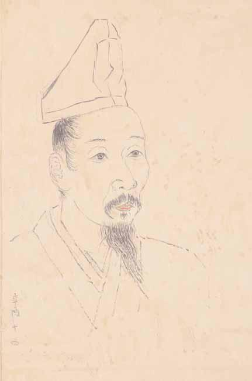

# 19　<ruby>三条西実<rt>さんじょうにしさね</rt></ruby><ruby>隆<rt>たか</rt></ruby><ruby>像<rt>ぞう</rt></ruby><ruby>紙<rt>かみ</rt></ruby><ruby>形<rt>がた</rt></ruby>

<a href="../pdf/019.pdf" target="_blank">PDF</a>

一紙。縦四一・二cm、横二五・八cm。紙本墨画。

室町時代の<ruby>公卿<rt>くぎょう</rt></ruby>三条西実隆（一四五五〜一五三七）を描いた<ruby>土<rt>と</rt></ruby><ruby>佐<rt>さ</rt></ruby><ruby>光<rt>みつ</rt></ruby><ruby>信<rt>のぶ</rt></ruby>の紙形（肖像画の下絵）。三条西家伝来の、<ruby>正親<rt>おおぎ</rt></ruby><ruby>町<rt>まち</rt></ruby><ruby>三条<rt>さんじょう</rt></ruby><ruby>公<rt>きん</rt></ruby><ruby>秀<rt>ひで</rt></ruby>の日記の<ruby>部<rt>ぶ</rt></ruby><ruby>類<rt>るい</rt></ruby><ruby>記<rt>き</rt></ruby>「<ruby>槐御抄<rt>かいぎょしょう</rt></ruby>」に挟み込まれていた。史料編纂所が所蔵する重要文化財の『<ruby>実<rt>さね</rt></ruby><ruby>隆<rt>たか</rt></ruby><ruby>公<rt>こう</rt></ruby><ruby>記<rt>き</rt></ruby>』<ruby>文<rt>ぶん</rt></ruby><ruby>亀<rt>き</rt></ruby>元（一五〇一）年十月四日条に、当代一の絵師土佐光信が実隆邸を訪れ、<ruby>北<rt>きた</rt></ruby><ruby>野<rt>の</rt></ruby><ruby>天<rt>てん</rt></ruby><ruby>神<rt>じん</rt></ruby><ruby>縁<rt>えん</rt></ruby><ruby>起<rt>ぎ</rt></ruby><ruby>絵<rt>え</rt></ruby>の製作について相談し、その折、自分の肖像の紙形を描かせたと記される。料紙左下に「<ruby>辛<rt>しん</rt></ruby><ruby>酉<rt>ゆう</rt></ruby>十四」とあるのが日記と一致する。「十分に似ず、<ruby>比興<rt>ひきょう</rt></ruby>（興ざめ）なり」との感想も日記に書かれている。 〔参考〕谷信一「実隆像の紙形」（『美術史』一七、一九五五）。黒田日出男「奇跡的に残った肖像画」（『ＵＰ』三五○、二○○一）。

 

<figure>
    
    <figcaption>三条西実隆像紙形（土佐光信筆）</figcaption>
</figure>