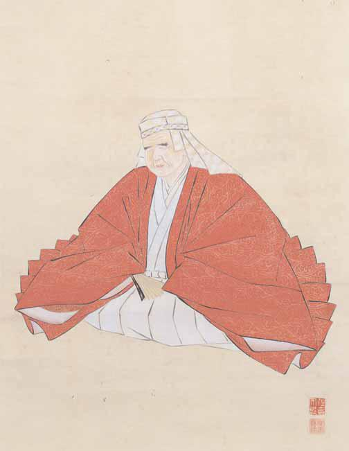

# 20　<ruby>塙<rt>はなわ</rt></ruby><ruby>保<rt>ほ</rt></ruby><ruby>己<rt>き</rt></ruby><ruby>一<rt>いち</rt></ruby><ruby>画<rt>が</rt></ruby><ruby>像<rt>ぞう</rt></ruby>（<ruby>模<rt>も</rt></ruby><ruby>写<rt>しゃ</rt></ruby>）

<a href="../pdf/020.pdf" target="_blank">PDF</a>

呂‐九○。一幅。縦九一・四cm、横四〇・七cm。紙本着色。

塙保己一（一七四六〜一八二一）は、武蔵国出身の国学者。七歳の時に失明。江戸で<ruby>賀茂<rt>かもの</rt></ruby><ruby>真<rt>ま</rt></ruby><ruby>淵<rt>ぶち</rt></ruby>らに学び、和漢の学に通じた。寛政五（一七九三）年、幕府に<ruby>和<rt>わ</rt></ruby><ruby>学<rt>がく</rt></ruby><ruby>講<rt>こう</rt></ruby><ruby>談<rt>だん</rt></ruby><ruby>所<rt>しょ</rt></ruby>の設立を許され、古典研究、史料収集・編纂を行った。日本の典籍を集成した『<ruby>群書類従<rt>ぐんしょるいじゅう</rt></ruby>』五三○巻を刊行した。また、編年史料集である塙史料を編纂した。肖像画は、一周忌に長女が江戸幕府の御用絵師<ruby>住<rt>すみ</rt></ruby><ruby>吉<rt>よし</rt></ruby><ruby>広<rt>ひろ</rt></ruby><ruby>定<rt>さだ</rt></ruby>（一七九三〜一八六三）に依頼して制作。史料編纂所本は塙家所蔵の画像の模写。

 

<figure>
    
    <figcaption>塙保己一（模写）</figcaption>
</figure>