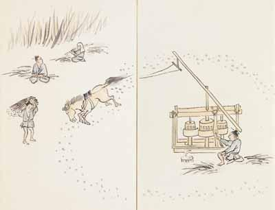
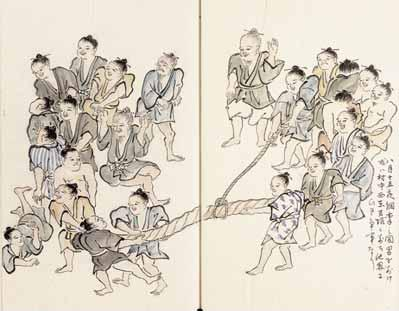

# 21　<ruby>南<rt>なん</rt></ruby><ruby>島<rt>とう</rt></ruby><ruby>雑<rt>ざつ</rt></ruby><ruby>話<rt>わ</rt></ruby>（国宝）

<a href="../pdf/021.pdf" target="_blank">PDF</a>

Ｓ島津家文書‐一‐一。一通。縦三〇・九cm、横四八・二cm。

江戸時代の<ruby>奄<rt>あま</rt></ruby><ruby>美<rt>み</rt></ruby><ruby>大<rt>おお</rt></ruby><ruby>島<rt>しま</rt></ruby>の社会・産業・自然の図画・記録の書。南島雑話は総称。<ruby>名<rt>な</rt></ruby><ruby>越<rt>ごや</rt></ruby><ruby>左<rt>さ</rt></ruby><ruby>源<rt>げん</rt></ruby><ruby>太<rt>た</rt></ruby><ruby>時<rt>とき</rt></ruby><ruby>行<rt>ゆき</rt></ruby>（<ruby>時<rt>とき</rt></ruby><ruby>敏<rt>とし</rt></ruby>。一八一九〜八一）著述の「<ruby>大<rt>だい</rt></ruby><ruby>嶹<rt>とう</rt></ruby><ruby>竊<rt>せつ</rt></ruby><ruby>覧<rt>らん</rt></ruby>」・「大嶹<ruby>便<rt>びん</rt></ruby><ruby>覧<rt>らん</rt></ruby>」・「大嶹<ruby>漫<rt>まん</rt></ruby><ruby>筆<rt>ぴつ</rt></ruby>」・「<ruby>南<rt>なん</rt></ruby><ruby>島<rt>とう</rt></ruby><ruby>雑<rt>ざっ</rt></ruby><ruby>記<rt>き</rt></ruby>」と、「南島雑話」（一・二及び三の二冊）・「南島雑話附録」の二類、六部七冊。大島の図解民俗・自然誌として評価が高い。奄美諸島は一五世紀頃から琉球国領であったが、慶長十四（一六○九）年の琉球征服により島津家領とされた。しかし、近世においても琉球風の習俗は伝えられた。左源太は、島津家の上級藩士で、嘉永二（一八四九）年、次代藩主に島津<ruby>斉彬<rt>なりあき</rt></ruby>らを擁立しようとした<ruby>内<rt>ない</rt></ruby><ruby>訌<rt>こう</rt></ruby>（お<ruby>由<rt>ゆ</rt></ruby><ruby>羅<rt>ら</rt></ruby>騒動）に坐し、嘉永三年から安政二（一八五五）年まで遠島となり、大島<ruby>名<rt>な</rt></ruby><ruby>瀬<rt>ぜ</rt></ruby><ruby>間<rt>ま</rt></ruby><ruby>切<rt>ぎり</rt></ruby><ruby>小宿<rt>こしゅく</rt></ruby>（鹿児島県名瀬市）に<ruby>謫居<rt>たっきょ</rt></ruby>した。島人と親しく交わり、異国船来着に備える絵図作成にも参加した。「南島雑話附録」は、文政十二（一八二九）年に大島に派遣された<ruby>御<rt>ご</rt></ruby><ruby>薬<rt>やく</rt></ruby><ruby>園<rt>えん</rt></ruby><ruby>方<rt>がた</rt></ruby>の<ruby>見<rt>けん</rt></ruby><ruby>聞<rt>ぶん</rt></ruby><ruby>役<rt>やく</rt></ruby>伊藤<ruby>助<rt>すけ</rt></ruby><ruby>左<rt>ざ</rt></ruby><ruby>衛<rt>え</rt></ruby><ruby>門<rt>もん</rt></ruby>の著述を左源太が転写したもの。「南島雑話」一・二・三も、最近の研究で、伊藤の著述を左源太が転写したものとされている。草稿の一部（奄美博物館所蔵）、『大嶹便覧』の自筆<ruby>稿本<rt>こうほん</rt></ruby>（鹿児島県立図書館所蔵）が残る。島津家本は明治時代に稿本や「南島雑話」「南島雑話附録」を整序した浄書本。同系本に永井本（東洋文庫に翻刻。奄美博物館所蔵）がある。島津家本と別の編成をなすのが鹿児島大学本（『日本庶民生活史料集成』一に翻刻）。砂糖しぼりの図は「大嶹漫筆」に収める。奄美諸島は、一八世紀初頭から薩摩藩によりサトウキビ生産を強制された。<ruby>綱<rt>つな</rt></ruby><ruby>牽<rt>ひき</rt></ruby>の図は「南島雑話」一に収める。「八月十五夜綱牽之図、男を別け、或ハ村中西東方限ニ別ち、他界にひき争う事なり」と説明がある。髪を結い<ruby>簪<rt>かんざし</rt></ruby>を挿す習俗は、琉球と同じ。〔参考〕『南島雑話』（東洋文庫、平凡社、一九八四）。『日本庶民生活史料集成』一・二○（三一書房、一九六八・七二）。

 

<figure>
    
    <figcaption>砂糖しぼりの図</figcaption>
</figure>

<figure>
    
    <figcaption>綱牽きの図</figcaption>
</figure>