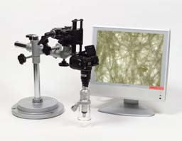
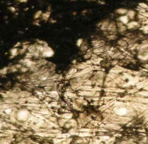
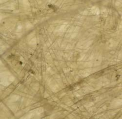
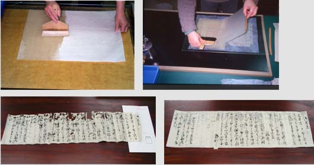
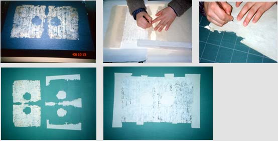

# 史料保存技術への招待

* [谷　昭佳](#1)	：歴史研究の裏側‐伝統技術とサイエンスの融合（写真）-
* [高島　晶彦](#2)	：史料編纂所における修復について

## 歴史研究の裏側‐伝統技術とサイエンスの融合（写真）-

史料保存技術室　　谷　昭佳

　複製技術として生まれた写真は、古文書研究の場において二次資料を作成する手段として、早くから利用されています。それらの多くは、写真によって映像化された文字や文章の情報を分析するかたちで利用されています。一方で写真による映像は、古文書から墨の状態や紙の折、紙質など《もの》としての情報を提示することも可能です。しかし、《もの》としての情報を一般化するための最適な記述方法がないために、積極的には利用されていないのが現状です。そこで、史料編纂所では《もの》としての古文書情報の分析と記録手法の確立に向け、様々な実験的取り組みを行っています。なかでも、デジタルカメラを利用した透過光・顕微鏡・近赤外線撮影は、《もの》情報を記録するための有効な手段となっています。

### ●顕微鏡撮影

　小型実体顕微鏡と小型市販デジタルカメラを専用アダプターで組み合わせることにより、比較的簡便に顕微鏡画像を得ることができます。これにより、墨の滲みや紙質に関する調査先での印象を画像として記録し持ち帰ることが可能となりました。

署名と花押が重なっている墨部分の顕微鏡画像

文書修理前の紙質調査顕微鏡画像

## 史料編纂所における修復について
史料保存技術室　高島　晶彦

　伝来過程の中で、虫害による損傷等によって傷んだ歴史史料（古文書等）を表装という伝統技術をベースに、修理対象となる「もの」の価値等を正確に理解しながら、できるだけ伝来した状態（原型）を残し、かつ可逆性のある方法や修理後に影響の少ない長期的に安定した材料を選択して作業を行っています。特に虫損箇所（虫穴）に補填する紙については、オリジナルに近いものを使用しております。そのため写真室と共同で、デジタルカメラを利用した透過光・顕微鏡撮影を行なって、非破壊による紙質の分析をしています。  
　主な作業として、「裏打ち」と「繕（つくろ）い」というのがあります。

　裏打ちは、補修紙に糊刷毛で水糊【生麩（しょうふ）糊を濾して水でうすめたもの】を均等につけ、糊のついた紙を移動して置き、しわができないように平らに下ろしながら、撫刷毛で中から外にむかって撫で付けて密着させます。この後、仮張りに張り込んで乾燥させます。

　繕いは、修理対象の史料に似た補修紙を欠失した部分にあてて、実際の大きさより若干大きくとって、周囲を刃物で毛羽立たせながら整形します。毛羽に薄い糊をつけて、欠失した部分にはめ込むように埋めていきます。その後プレス乾燥をして落ち着かせます。  
　このように、作業は紙・糊・水・刷毛を使う単純なものですが、単純作業ゆえに巧妙で高度な技術が要求されます。技術者は、先人の技量に感心する謙虚な姿勢をもって日々技術の研鑚を行いつつ、時代の進展とともに求められる技術内容を察知し、他分野にわたった広い知識を取り入れ、技術開発をしなければなりません。  
　修理後には、修理情報等（修理前・修理後の寸法や修理方針など）がわかる報告書を作成しています。  
　但し修復は、最終手段であって、たとえきちんとできたとしても、ある面では歴史史料の持つ一次的史料としての性格を失わせることになります。したがってそれほど劣化・損傷が認められないのにもかかわらず、体裁を整える目的だけの修理や余計な手を加えることは避けるべきだと思われます。その「もの」にとって何が必要で、何が不必要かを適切に判断しなければなりません。