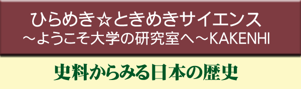
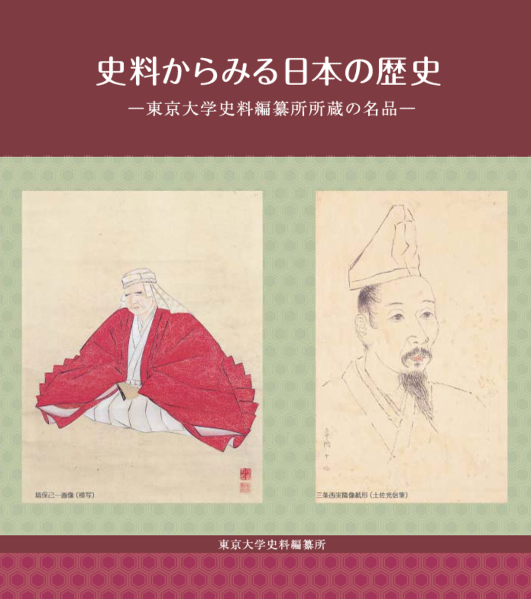

　東京大学史料編纂所では、独立行政法人日本学術振興会の平成17年度研究成果の社会還元・普及事業として、ひらめき☆ときめきサイエンス～ようこそ大学の研究室へ～KAKENHI「史料からみる日本の歴史」を実施しました。  
　高校生を中心とした若い方々に、史料や史料データベースから歴史を探る楽しみを理解してもらうためのプログラムです。  
　当日は、11校から39名(高校生29人、教員10人)が参加されました。史料編纂所の保立道久所長より、参加した高校生に未来博士の修了証が授与されました。  
　この企画は、特別推進研究(COE)「前近代日本史料の構造と情報資源化の研究」(2000～2004年度。研究拠点、前近代日本の史料遺産プロジェクト：Japan Memory Project)の研究成果によるものです。  
　当日は、教科書にでてくる著名な史料などを掲載した図録「史料からみる日本の歴史－東京大学史料編纂所所蔵の名品－」を資料として配布しました。図録はインターネット版を閲覧できます。

 

 

## 日時

2005年12月17日(土)　午前10時～午後4時

## 会場

東京大学史料編纂所

## プログラム

### 史料研究の世界へ

* 石上　英一「僕は奄美諸島史を知りたい」
* 林　　譲　「今日は、自分の花押(サイン)を作って帰ろう －モノとしての史料研究の可能性」
* 横山　伊徳「モノノミカタが変わるとき」

###  	史料保存技術への招待

* 谷　　昭佳「歴史研究の裏側－伝統技術とサイエンスの融合(写真)－」
* 高島　晶彦「史料編纂所における修復について」

### 史料研究室への招待(時代別に希望の講義を受講)

* 稲田奈津子「墓からみた古代社会」
* 本郷　恵子「中世史料の姿をみる－将軍の文書から百姓申状まで－」
* 杉森　玲子「江戸の町と安政大地震」
* 木村　直樹「江戸時代の日本と外国の関係－どんな人がきたのうだろうか？－」

## 注意

このホームページに掲載された史料の画像を、史料編纂所の許可なく印刷したり頒布することを禁止します。史料の掲載、複製については、史料編纂所図書部にお問い合わせ下さい。また、史料解説・講義ノートを引用する場合は、出典(史料編纂所「史料からみる日本の歴史」ホームページ版))と著者名を明示して下さい。

## 謝辞

「史料からみる日本の歴史」のホームページは、平成17年度科学研究費補助金・基盤研究（A）「前近代日本史料の国際的利用環境構築の研究」により、史料編纂所所蔵史料のネットワークを通じての公開、教育への活用のために制作しました。

 

